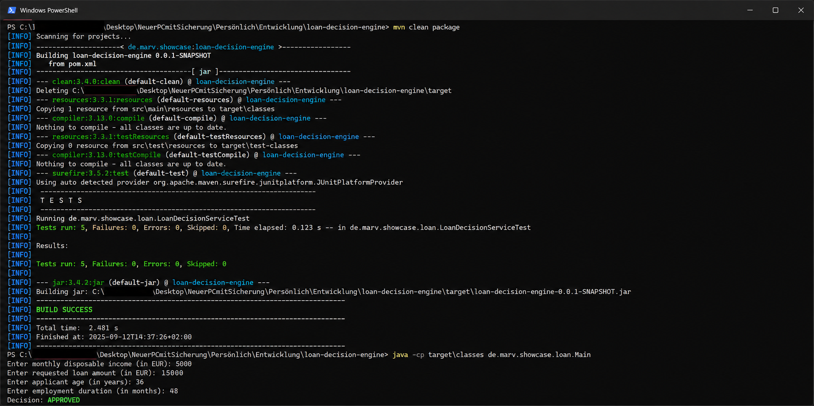

# Loan Decision Engine

A small Java showcase project implementing a rule-based loan decision engine.

The project demonstrates object-oriented Java development, separation of business rules and decision logic, automated testing with JUnit, and a reproducible Maven build.

## Business Rules

A loan application is approved only if all configured rules are satisfied:

- Disposable income >= 1,000 EUR
- Loan amount <= 20,000 EUR
- Applicant age >= 18 years
- Employment duration >= 12 months

## Architecture

The application separates loan application data, individual business rules, and the central decision logic.

- `LoanApplication` - represents the loan application data
- `LoanRule` - common interface for all business rules
- `IncomeRule` - validates disposable income
- `LoanAmountRule` - validates the requested loan amount
- `AgeRule` - validates the applicant's age
- `EmploymentRule` - validates employment duration
- `LoanDecisionService` - evaluates all configured rules
- `Decision` - represents `APPROVED` or `REJECTED`

The `LoanDecisionService` manages a list of `LoanRule` implementations. Each rule implements the same interface and can therefore be evaluated through a common contract.

This allows additional business rules to be added without changing the basic evaluation structure.

## Technologies

- Java 25
- Maven
- JUnit 5
- Git / GitHub
- Eclipse IDE

## Build and Test

Run the automated tests:

```bash
mvn test
```

Create a clean build including compilation, automated tests, and JAR packaging:

```bash
mvn clean package
```

The generated build artifacts are created in the `target` directory.

Run the application from the compiled Maven classes:

```bash
java -cp target/classes de.marv.showcase.loan.Main
```

## Demo

Example execution and successful Maven/JUnit build:



## Purpose

This project was created as a compact Java showcase focusing on:

- Object-oriented programming
- Interfaces and polymorphism
- Separation of business rules and decision logic
- Automated testing with JUnit
- Reproducible builds with Maven
- Version control with Git

The project intentionally keeps the functional scope small in order to focus on a clean and understandable Java architecture.